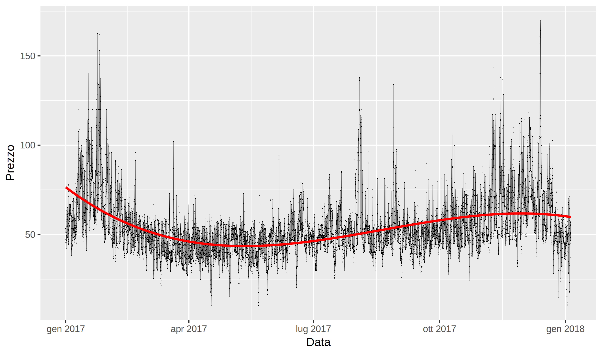

# GME Exploratory Data Analysis
Exploratory Data Analysis in R - Open Data GME (Gestore dei Mercati Energetici)

## Power markets
### CDE
Consegna derivati energia	
### MB
Mercato bilanciamento (6 sessioni)
### MGP
Mercato giorno prima (day-ahead)
Lo scraping degli esiti di mercato è stato utilizzato per visualizzare l'andamento del PUN day-ahead, anche attraverso una regressione polinomiale (n=3)

### MI
Mercato infragiornaliero (7 sessioni)
### MPEG
Mercato prodotti elettrici giornalieri
### MSD
Mercato dei servizi di dispacciamento (6 sesssioni)
### MTE
Mercato a termine
### PCE
Mercato dei conti energia a termine

## Emissions markets
### TEE
Titoli di efficienza energetica
### GO
Garanzie d'origine

## Gas markets
### MGP-GAS
TBD
### MGS
TBD
### MI-GAS
TBD
### MPL
TBD
### MT-GAS
TBD
### P-GAS
TBD
